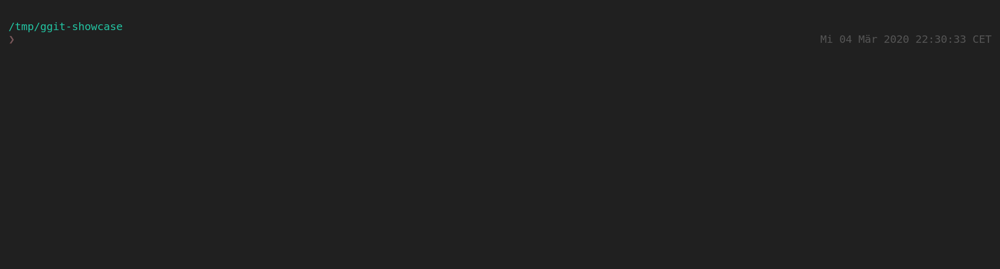

[![Build Status][travis-badge]][travis-link]
[![MIT License][license-badge]](LICENSE)
# ggit
A simple program to list status of all repositories under a given directory

## Getting Started

Download the [AppImage][release-download] and use the program right away:

```sh
wget https://github.com/Maverobot/ggit/releases/download/continuous/ggit-linux-amd64 -O ~/.local/bin/ggit
chmod +x ~/.local/bin/ggit
```

## Usage
```sh
Usage: ggit [flags]
  -color
    	Whether the table should be rendered with color. (default true)
  -depth int
    	The depth ggit should go searching. (default 2)
  -path string
    	The path to the parent directory of git repos. (default "./")
  -update
    	Try go-github-selfupdate via GitHub
  -version
    	Show version
```

Example:
```sh
# By default, it takes current directory path as input
cd a_folder_with_many_repos
ggit

# Or,
ggit -path path_to_folder_with_many_repos -depth 1
```

Simple showcase:



[travis-badge]:     https://travis-ci.com/Maverobot/ggit.svg?branch=master
[travis-link]:      https://travis-ci.com/Maverobot/ggit
[license-badge]:    https://img.shields.io/badge/License-MIT-blue.svg
[release-download]: https://github.com/Maverobot/ggit/releases/download/continuous/ggit-linux-amd64
